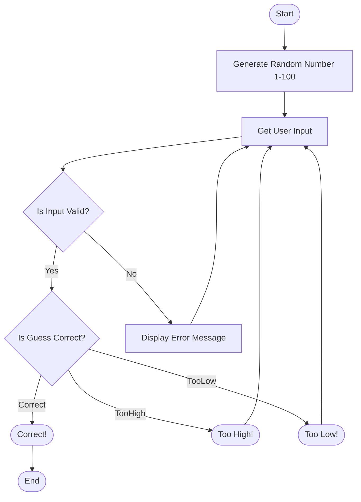

# Random Guessing Game Flowchart

```mermaid
flowchart TD
    Start([Start]) --> GenerateNumber[Generate Random Number 1-100]
    GenerateNumber --> UserInput[Get User Input]
    UserInput --> CheckInput{Is Input Valid?}
    
    CheckInput -- Yes --> Compare{Is Guess Correct?}
    CheckInput -- No --> InvalidInput[Display Error Message]
    InvalidInput --> UserInput
    
    Compare -- Correct --> CorrectGuess([Correct!])
    Compare -- TooHigh --> HighGuess([Too High!])
    Compare -- TooLow --> LowGuess([Too Low!])
    
    HighGuess --> UserInput
    LowGuess --> UserInput
    CorrectGuess --> End([End])
```
initially the game begins by generating a random number between 1-100

asks the user for a prompt and checks validity

generates feedback based on input

